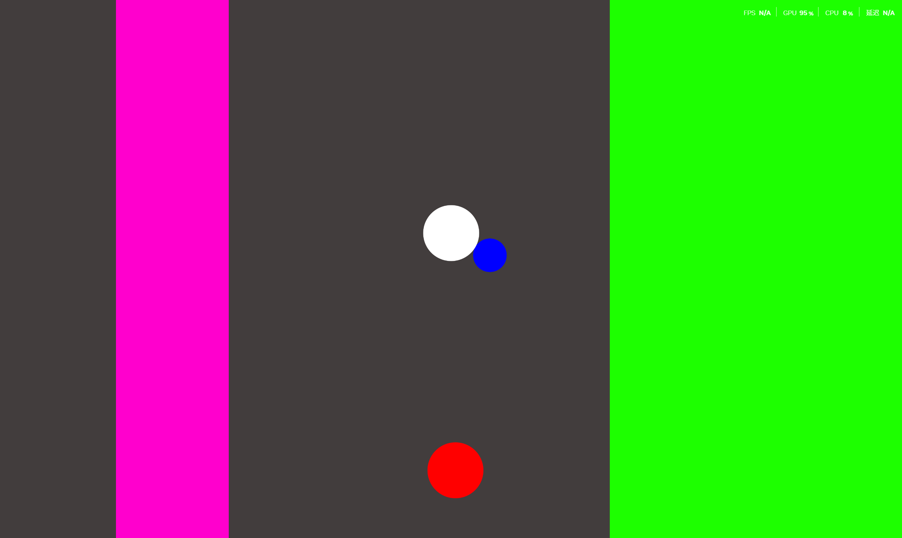

# Software-Engineering-Final-project-My034Game-Demo-
## Graphical Abstract,

---

## 1. Purpose of the Software
- **Software Type**: PC034game
- **Development Process**: Agile (Scrum) 
- **Reason for Choosing**: 
 - Agile：Suitable for rapid iteration and incremental feature development.
- **Target Usage & Market**: 
 - Leisure and entertainment
 - Casual game enthusiastes

---

## 2. Software Development Plan
### Development Process
1. Requirements Analysis
2. Interface and Logic Design
3. Coding Implementation
4. Testing and Debugging
5. Demo Video Production

### Members (Roles & Responsibilities)
- Member 1:Game Planning + Program
- Member 2:Program + Game Planning
- Member 3:Art Design + Level Design
- Member 4:Video Editing + Art Design
- Contribution Portion：40% / 30% / 30%

### Schedule,
- day 1: Project initiation + Requirements confirmation
- day 2: Code development
- day 3: Code development+UI design
- day 4: Level Design + Testing
- day 5: Testing + Improvement
- day 7: Document submission + Demo video production

### Algorithm
- Game core logic:：This is a game where players avoid chasers and connect spheres to destroy triangles.
- Data Structure：fool

### Current Status
- Finshed：game core function
- Achieved: Demo

### Future Plan
- Add more levels
- Optimize graphics and sound effects
- Support more platforms
- Participate in the 034 Competition

---

## 3. Demo Video,
[YouTube URL ](这里粘贴你的视频地址)
- Content: How to run + How to play

---

## 4. Development & Running Environment,
- **Programming Language**: C#
- **OS**: Windows 10 / 11
- **Minimum Hardware**: CPU i3+, 4GB RAM, 1GB storage
- **Required Packages/Libraries**:
 - Unity 
- **How to Run**:
 1. Download : asd.z01, asd.z02, asd.zip
 2. Extract the files 
 3. run x.exe
